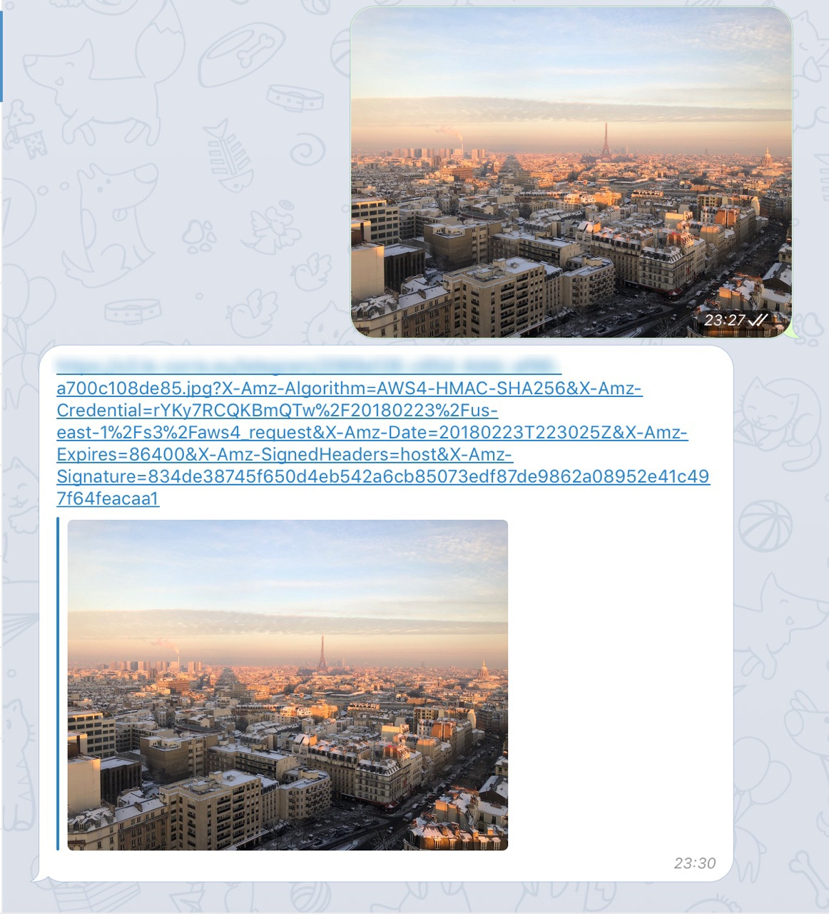

# minio-telegram-bot

[](https://travis-ci.com/clementlecorre/minio-telegram-bot)
[](https://microbadger.com/images/cl3m3nt/minio-telegram-bot "Get your own image badge on microbadger.com")

Bot telegram to upload files to an S3 (minio)



## Dependency

*   [caarlos0/env](github.com/caarlos0/env)

*   [minio/minio-go](github.com/minio/minio-go)

*   [satori/go.uuid](github.com/satori/go.uuid)

*   [sirupsen/logrus](github.com/sirupsen/logrus)

*   [tucnak/telebot.v2](gopkg.in/tucnak/telebot.v2)


## Env variable

*   TELEGRAM_USERID
*   TELEGRAM_TOKEN
*   MINIO_URL
*   MINIO_ACCESS_KEY
*   MINIO_SECRET_KEY

## Compose example


```
version: "3.3"
services:
  bot:
    image: cl3m3nt/minio-telegram-bot
    environment: 
      - TELEGRAM_USERID=
      - TELEGRAM_TOKEN=
      - MINIO_URL=
      - MINIO_ACCESS_KEY=
      - MINIO_SECRET_KEY=
```
